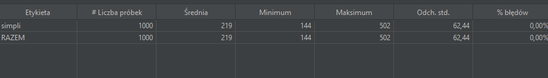
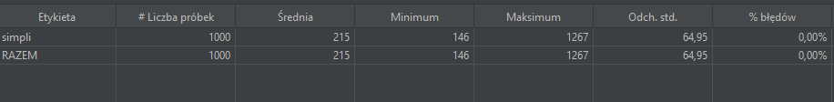

# Test strony internetowej simplilearn

Platforma edukacyjna oferująca szeroką gamę kursów online w dziedzinie technologii, zarządzania projektami, danych, programowania itp.
Strona oferuje zarówno kursy jednostkowe, jak i programy specjalistyczne, które prowadzą do certyfikacji w różnych dziedzinach.

## Podgląd Testu:

Platforma edukacyjna musi spełniać wymagania umożliwiające obsługę łącznie 1000 użytkowników końcowych. W ramach zestawu testów obciążeniowych przeprowadzimy serię testów, wysyłając tę liczbę zapytań w różnych interwałach czasowych, aby ocenić wydajność platformy edukacyjnej.

### Status 1:

1000 wątków w 150 sekund

 
Poniżej następujące wyniki:
 
Średnia: 219ms
 
Minimun: 144ms
 
Maksimum: 502ms
 
Procent błędu: 0%

### Status 2:

1000 wątków w 120 sekund

 
Lekkie zmiany w wynikach, wartość maksiumum wzrosła z 502ms na 21241 tys. ms, test będzie dalej kontynuowany.

 
Poniżej następujące wyniki:
 
Średnia: 228ms
 
Minimun: 148ms
 
Maksimum: 21241ms
 
Procent błędu: 0%

### Status 3:

1000 wątków w 90 sekund

 
Zauważono spadek Średniej = 203ms oraz Maksimum = 461ms.

 
Poniżej następujące wyniki:
 
Średnia: 203ms
 
Minimun: 145ms
 
Maksimum: 461ms
 
Procent błędu: 0%

### Status 4:

1000 wątków w 60 sekund

 
Zaobserwowano limit zwiększenie opóźnienia maksimum aż z 461ms do 1267 tys ms. Kontynuacja testu w celu znalezienia kolejnego limitu np: pojawienie się błędu połączeń HTTP.

 
Poniżej następujące wyniki:
 
Średnia: 215ms
 
Minimun: 146ms
 
Maksimum: 1267ms
 
Procent błędu: 0%

### Status 5:

1000 wątków w 40 sekund

 
Osiągnięto kolejny limit maksimum na 21334 tys ms. Kontynuacja testu.

 
Poniżej następujące wyniki:
 
Średnia: 244ms
 
Minimun: 154ms
 
Maksimum: 21334ms
 
Procent błędu: 0%

### Status 6:

1000 wątków w 30 sekund

 
Następny wzrost maksimum do 21261 tys ms.

 
Poniżej następujące wyniki:
 
Średnia: 267ms
 
Minimun: 159ms
 
Maksimum: 21261ms
 
Procent błędu: 0%

### Status 7:

1000 wątków w 20 sekund

 
Spadek maksimum z 21261 tys ms na 1311 tys ms. Kontynuacja dalej testu. Wzrost średniej na 275ms z 267ms oraz Minimum na 166ms z 159ms.

 
Poniżej następujące wyniki:
 
Średnia: 275ms
 
Minimun: 166ms
 
Maksimum: 1311ms
 
Procent błędu: 0%

### Status 8:

1000 wątków w 15 sekund

 
Bez zmian. Jedynie wzrost średniej na 363ms oraz maksimum na 1402 tys ms.

 
Poniżej następujące wyniki:
 
Średnia: 363ms
 
Minimun: 177ms
 
Maksimum: 1402ms
 
Procent błędu: 0%

### Status 9:

1000 wątków w 10 sekund

 
Limit dużego wzrostu opóźnienia. Średnie opóźnienie wzrosło z 363ms do ponad 2289 tys.ms. Zwiększono maksymalne opóźnienie z 1402 tys.ms do 22570 tys. ms. Dalsza kontynuacja testu.

 
Poniżej następujące wyniki:
 
Średnia: 2289ms
 
Minimun: 292ms
 
Maksimum: 22570ms
 
Procent błędu: 0%

### Status 10:

1000 wątków w 6 sekund

 
Poraz kolejny wzrost średniego i maksymalnego opóźnienia. Kontynuacja testu w celu znalezienia pierwszych występujących błędów połączeń HTTP.

 
Poniżej następujące wyniki:
 
Średnia: 9012ms
 
Minimun: 199ms
 
Maksimum: 38401ms
 
Procent błędu: 0%

### Status 11:

1000 wątków w 4 sekund

 
Osiągnięto następujący wynik: Średnia wzrosła z 9012 tys.ms na 11666 tys.ms a maksymalna zwiększyła się aż do 177019 tys.ms.
Procent błędów wzrósł z 0% do 0,20%. Osiągnęliśmy limit, gdzie przerywamy kontynuację testów obciążeniowych.

 
Poniżej następujące wyniki:
 
Średnia: 11666ms
 
Minimun: 294ms
 
Maksimum: 177019ms
 
Procent błędu: 0,20%

